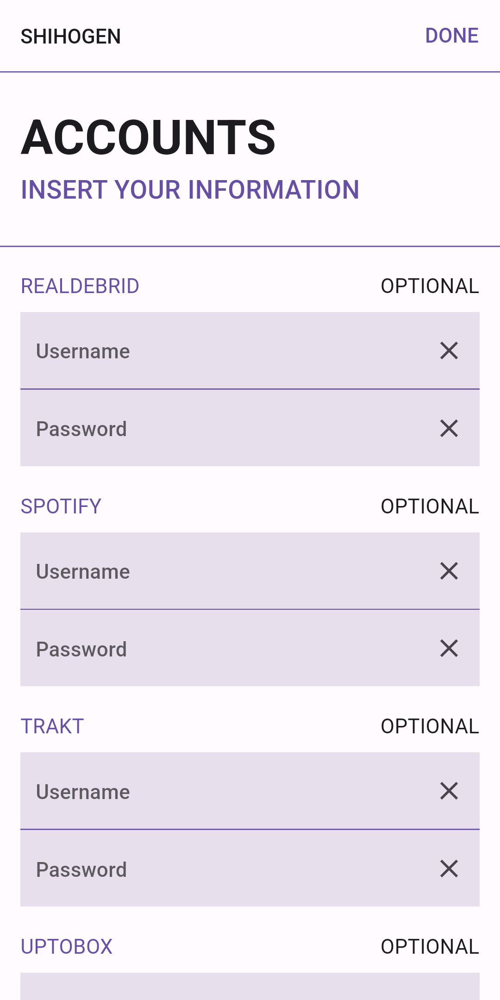

# <samp>OVERVIEW<samp>

Lorem ipsum dolor sit amet, consectetur adipiscing elit.

#### ON YOUR MOBILE (DARKEN)


#### ON YOUR MOBILE (BRIGHT)



#### ON YOUR DEVICE 


# <samp>GUIDANCE</samp>

1. Enable the network debugging on your device.
1. Gather and launch the app on your mobile.
1. Follow instructions to attach your device.
1. Choose wallpaper for your home screen.
1. Insert optional accounts information.
1. Please wait until has succeeded is shown.

# <samp>DONATION</samp>

Support my work by sending me some crypto.

```txt
ADA: xxxxxxxxxxxxxxxxxxxxxxxxxxxxxxxxxxxxxxxxxxxxxxxxxxxxxxxxxxxxxxxxxxxxxxxxxxxxxxxxxxxxxxxxxxxxxxxxxxxxxxx
BCH: xxxxxxxxxxxxxxxxxxxxxxxxxxxxxxxxxxxxxxxxxx
BTC: xxxxxxxxxxxxxxxxxxxxxxxxxxxxxxxxxxxxxxxxxx
ETH: xxxxxxxxxxxxxxxxxxxxxxxxxxxxxxxxxxxxxxxxxx
XMR: xxxxxxxxxxxxxxxxxxxxxxxxxxxxxxxxxxxxxxxxxxxxxxxxxxxxxxxxxxxxxxxxxxxxxxxxxxxxxxxxxxxxxxxxxxxxxxx
```
